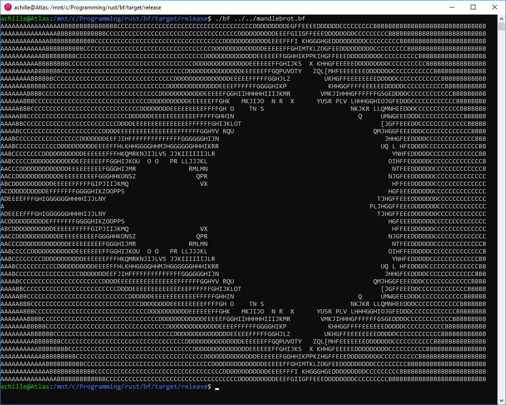
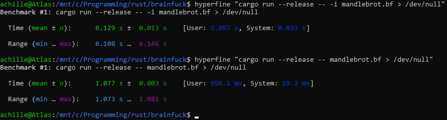

# bf

An interpreter + dynarec for the brainfuck esoteric programming language. Uses 8-bit wrapping memory cells, and a 30,000 byte memory array (no negative indices please!).

## Usage

To run a brainfuck program, just call `brainfuck <sourcefile>`. This will run the program by translating it into x86_64 assembly and running it as native code. To run a program using the interpreter instead, use `brainfuck -i <sourcefile>`.

## Example

## Benchmarks

### mandlebrot

Interpreter: 6.129s

Dynarec: 1.077s

