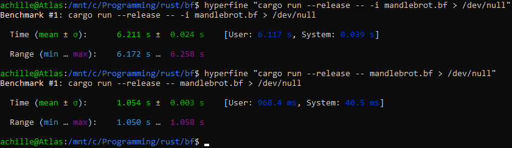

# bf

<<<<<<< HEAD
An interpreter + recompiler for the [brainfuck esoteric programming language](https://esolangs.org/wiki/brainfuck). Uses 8-bit wrapping memory cells, and a 30,000 byte memory array (no negative indices please!).
=======
An interpreter + dynarec for the brainfuck esoteric programming language. Uses 8-bit wrapping memory cells, and a 30,000 byte memory array (no negative indices please!).
>>>>>>> dbb99fbb3b23d7d1bb0e77424e5855f338febffd

## Usage

To run a program, just call `bf <sourcefile>`. This will run the program by translating it into x86_64 machine code and running it as native code. To run a program using the interpreter instead, use `bf -i <sourcefile>`.

## Example

## Benchmarks

### mandlebrot

Interpreter: 6.211s

Recompiler: 1.054s

